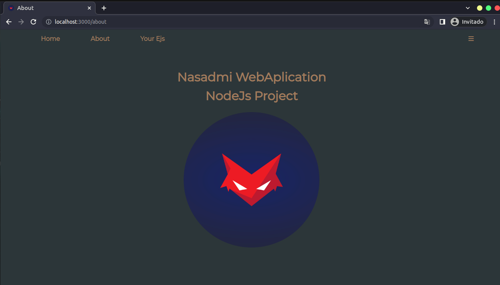

# This my first Project with NodeJS

## This is a Web Application because his have a forntent and backend, wrote width nodejs, the libraries and sources are in [SOURCES.md](SOURCES.md), this is an [INSTRUCTIONS.md](INSTRUCTIONS.md) and the [LICENSE.md](LICENSE.md). 

## In the home, the input is functionality, because you can search as if it were the input of google.

